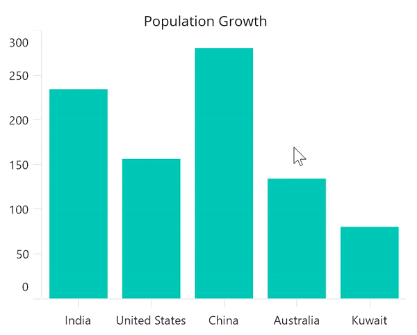

# How to display more data in the tooltip in .NET MAUI Chart (SfCartesianChart)

[.NET MAUI Chart](https://www.syncfusion.com/maui-controls/maui-charts) provides the support to display the needed information from its model of populated items source along with Tooltip UI customization with the help of [TooltipTemplate](https://help.syncfusion.com/cr/maui/Syncfusion.Maui.Charts.ChartSeries.html#Syncfusion_Maui_Charts_ChartSeries_TooltipTemplate) in the chart series, as shown in the following code example. 

Here, it displays both a country’s name and population details in the tooltip. By default, it displays the corresponding y-axis value of that segment.

```
<chart:SfCartesianChart>
    <chart:SfCartesianChart.BindingContext>
        <local:ViewModel/>
    </chart:SfCartesianChart.BindingContext>

    <chart:SfCartesianChart.Resources>
        <ResourceDictionary>
            <DataTemplate x:Key="tooltipTemplate">
                <HorizontalStackLayout>
                    <!--Template has BindingContext as its Segment named Item. From it, you can access the corresponding Model data-->
                    <Label Text="{Binding Item.Country}" TextColor="White" FontSize="12"/>
                    <Label Text=" : " TextColor="White" FontSize="12"/>
                    <Label Text="{Binding Item.Population}" TextColor="White" FontSize="12"/>
                </HorizontalStackLayout>
            </DataTemplate>
        </ResourceDictionary>
    </chart:SfCartesianChart.Resources>

    <chart:SfCartesianChart.XAxes>
        <chart:CategoryAxis/>
    </chart:SfCartesianChart.XAxes>

    <chart:SfCartesianChart.YAxes>
        <chart:NumericalAxis/>
    </chart:SfCartesianChart.YAxes>

    <chart:ColumnSeries ItemsSource="{Binding Data}"
                        XBindingPath="Country" YBindingPath="Population"
                        EnableTooltip="True"
                        TooltipTemplate="{StaticResource tooltipTemplate}">
    </chart:ColumnSeries>
</chart:SfCartesianChart>
```

## Output:



KB article - [How to display more data in the tooltip in MAUI Chart (SfCartesianChart)?](https://www.syncfusion.com/kb/13663/how-to-display-more-data-in-the-tooltip-in-maui-chart-sfcartesianchart)
